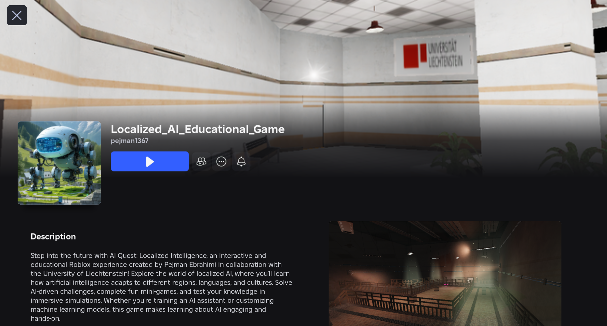
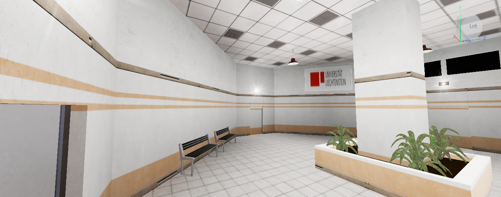
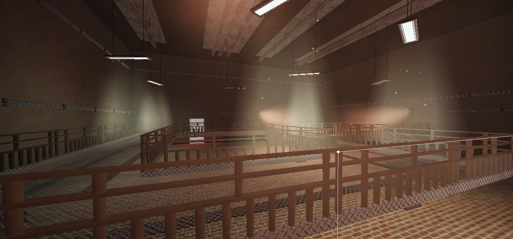
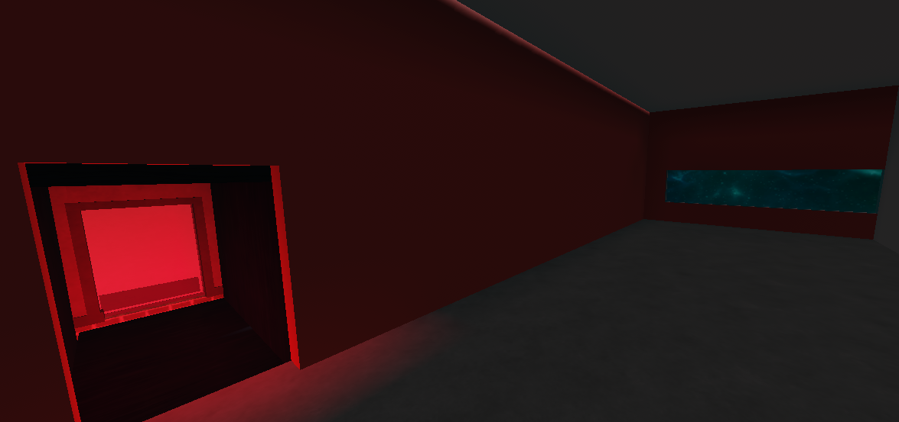
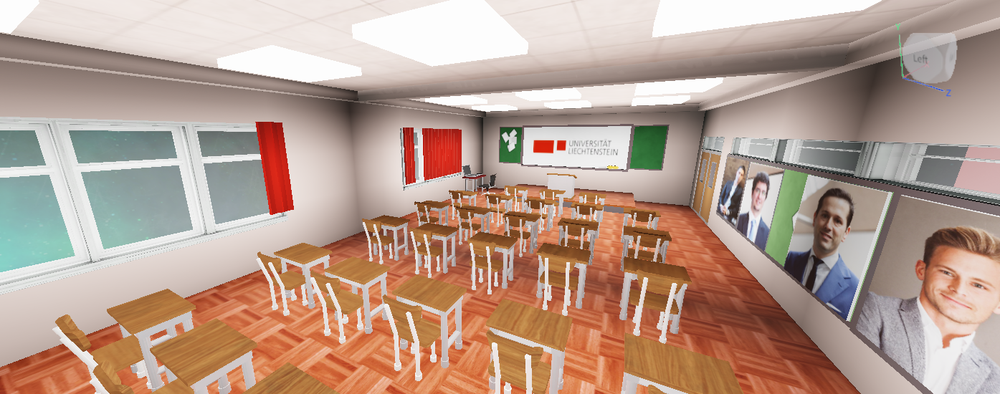
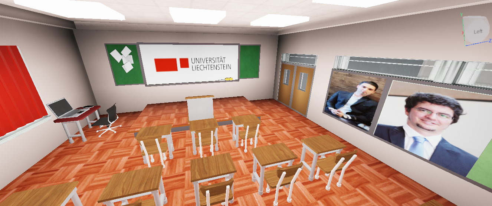
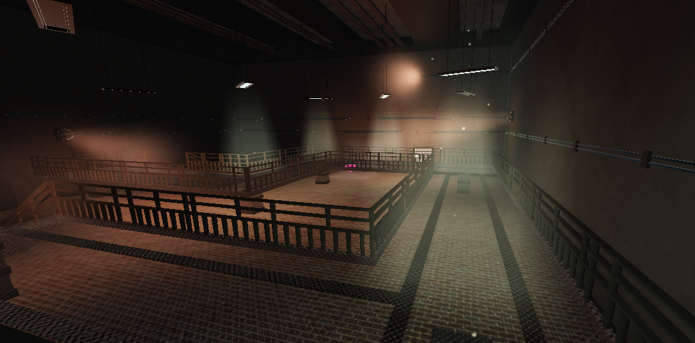
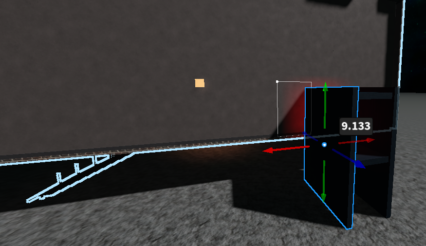
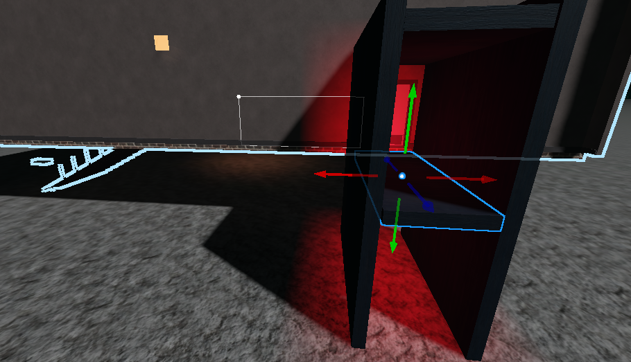
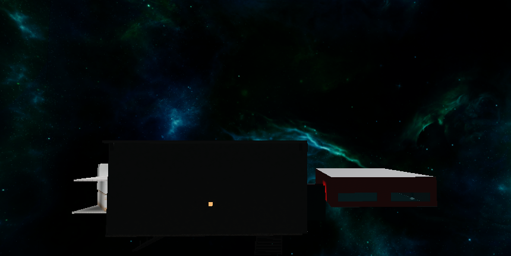

# Educational Game for Localized AI

## Table of Contents
- [Overview](#overview)
- [Game Description](#game-description)
- [Educational Purpose](#educational-purpose)
- [Game Mechanics](#game-mechanics)
- [Video Demonstration](#video-demonstration)
- [Implementation Details](#implementation-details)
  - [File Structure](#file-structure)
  - [Key Scripts](#key-scripts)
  - [Room Design](#room-design)
- [Installation and Setup](#installation-and-setup)
- [Gameplay Screenshots](#gameplay-screenshots)
- [Development Process](#development-process)
- [Contributors](#contributors)
- [Contact](#contact)

## Overview

This is an educational game developed in Roblox designed to test students' knowledge of Localized AI concepts. Created as part of the "AI Management, Strategy and Governance" course at the University of Liechtenstein, this game offers an interactive alternative to traditional paper-based exams.

## Game Description

This game challenges students to progress through a series of rooms by answering questions about Localized AI. Each room contains a question station that presents a multiple-choice question. Players must select the correct answer and then touch the room's exit door. If correct, the door opens and allows advancement to the next room. If incorrect, the player must restart from the beginning.

## Educational Purpose

This game was developed for the "Localized AI Development and Deployment" section of the AI Management, Strategy and Governance course at the University of Liechtenstein. The interactive format encourages engagement with course material in a memorable way while testing knowledge of important concepts in AI localization.

## Game Mechanics

- **Timed Challenges**: Players have 30 seconds in Rooms 1 and 3, and 60 seconds in Room 2 to answer questions and exit through the door
- **Question Stations**: Interactive stations in each room pose multiple-choice questions about Localized AI
- **Door Navigation**: Doors open only when the player selects the correct answer
- **Room Progression**: Players advance through three rooms of increasing difficulty
- **Restart System**: Incorrect answers or time expiration result in game over with restart option
- **Victory Celebration**: Completing all three rooms triggers a celebration with confetti and congratulatory message

## Video Demonstration

Watch this video to see game in action:

## Implementation Details

### File Structure

The game consists of four main script files:

1. **GameManager.lua** (Server Script)
   - Controls the game logic, question database, timer, and player state

2. **DoorController.lua** (Server Script)
   - Manages door behavior, opening/closing animations, and player interactions

3. **PlayerController.lua** (Local Script)
   - Handles player interactions with question parts and proximity prompts

4. **QuestionGui.lua** (Local Script)
   - Creates and manages the user interface for questions, timer, and game states

5. **FixedDoorWatchAudio.lua** (Local Script)
   - Manages room-specific audio that changes as players move between rooms

### Key Scripts

#### GameManager.lua
This script serves as the core of the game, managing:
- Question database for all rooms
- Player state tracking
- Room-specific timers (30s for Rooms 1/3, 60s for Room 2)
- Answer validation
- Room transitions

#### DoorController.lua
Handles the door mechanics including:
- Door touch detection
- Opening/closing animations
- Communication with GameManager to validate answers
- Player movement between rooms

#### QuestionGui.lua
Creates the user interface elements:
- Room timer display
- Question and answer UI
- Game over screen with restart/exit options
- Victory celebration with confetti

### Room Design

The game features three main rooms plus a victory area:
- **Room 1**: Introductory questions about Localized AI basics (30-second timer)
- **Room 2**: Intermediate questions about implementation aspects (60-second timer)
- **Room 3**: Advanced questions about challenges and solutions (30-second timer)
- **Victory Area**: Final celebration space with congratulatory message

Each room contains:
- A question station that triggers when approached
- A door that responds to correct answers
- Unique audio that plays while in the room

## Installation and Setup

1. Download or clone the repository
2. Open the place file in Roblox Studio
3. Ensure all scripts are placed in their correct locations:
   - Server scripts in ServerScriptService
   - Local scripts in StarterPlayerScripts or StarterGui as appropriate
4. Verify that all room models, question parts, and doors are properly named (Room1, QuestionPart1, Door1, etc.)
5. Test the game to ensure questions, timers, and doors function correctly. Meanwhile, `you can download the Roblox Player and search for "Localized_AI_Educational_Game"`.

## Gameplay Screenshots

*Starting area of the game*

*Approaching a question station*

*Answering a question about Localized AI*

*Transitioning between rooms*

*The timer counting down*

*Game over screen after an incorrect answer*

*Final victory celebration*

## Development Process

The development of DoorGo involved several stages:

*Initial concept and room layout design*

*Implementing the question system and door mechanics*

*Adding UI elements and testing game flow*

The game underwent multiple iterations to ensure smooth gameplay, proper question display, and reliable door mechanics. Special attention was paid to creating a robust restart system and room transition logic.

## Contributors

This educational game was developed as part of the "AI Management, Strategy and Governance" course at the University of Liechtenstein.

- **Dr. Pejman Ebrahimi** - Game design and implementation
- **Assoz. Prof. Dr. Johannes Schneider** - Project supervision 
- **Assoz. Prof. Dr. Benjamin van Giffen** - Course co-instructor

## Contact

For questions or more information about this educational game, please contact:

- Dr. Pejman Ebrahimi
  - Email: pejman.ebrahimi@uni.li or pejman.ebrahimi77@gmail.com
  - Institution: University of Liechtenstein, Information Systems Group

- Prof. Dr. Johannes Schneider
  - Institution: University of Liechtenstein, Information Systems Group

- Assoz. Prof. Dr. Benjamin van Giffen
  - Institution: University of Liechtenstein